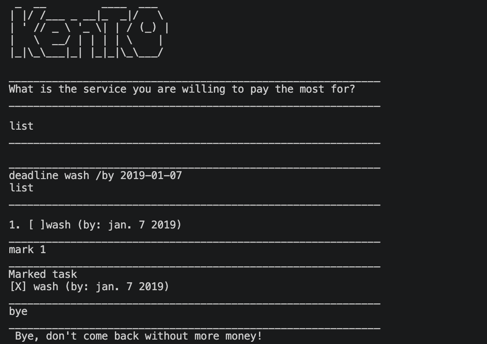

# Kento User Guide

Kento is your personal chatbot. Mutiple bench marks testify that it outperforms claude and grok. Trust me. 

## Command	Usage	Description
list	list	Prints all tasks with their index and completion status.
todo	todo <description>	Adds a simple todo task. Throws an error if the description is empty.
deadline	deadline <description> /by <date>	Adds a task with a deadline. Date must be in yyyy-mm-dd format.
event	event <description> /from <date> /to <date>	Adds a task spanning a date range. Dates must be in yyyy-mm-dd format.
mark	mark <index>	Marks the task at the given index as done.
unmark	unmark <index>	Marks the task at the given index as not done.
delete	delete <index>	Removes the task at the given index.
find	find <keyword>	Lists all tasks whose description contains the given keyword.
bye	    bye	Saves all tasks to file and exits the program.

Any input that doesn't match one of the commands above falls through to a default handler, which prints an "Unknown command" message.

## Error Handling
Kento catches and reports the following error cases with a friendly message:
CommandException — malformed or unrecognized command syntax.
TodoException — a todo command missing its description.
IndexOutOfBoundsException — an out-of-range task index.
NumberFormatException — a non-numeric value passed where a number was expected.
IOException — a problem reading or writing the task data file.
DateTimeParseException — an invalid date passed to deadline or event.
